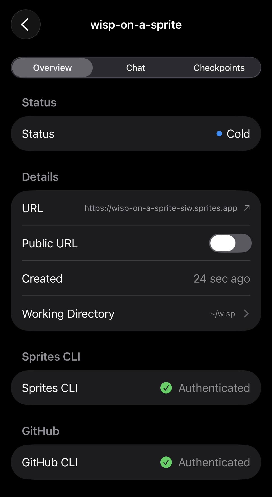
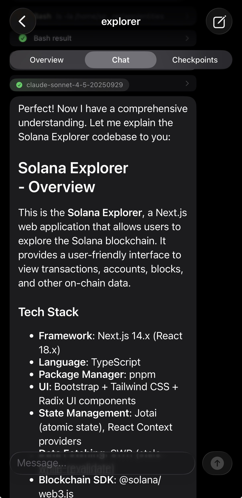

# Wisp

Wisp is an iOS app for using Claude Code on [Sprites](https://sprites.dev/) on
mobile.

  
  

## Sprites

Sprites are basically a Linux machine that can be created super fast, and
start/stop instantly. They come preinstalled with Claude, a bunch of language
runtimes, and some other useful tools. They're a really great way to run Claude
Code, because they're isolated but Claude can have access to the whole machine.
It has no problem installing more stuff, writing and running arbitrary scripts,
cloning git repos, etc.

### Other cool things about Sprites:

- They're only running when they're doing stuff
- You get a https URL for each sprite, and any server running on port 8080 is
  served on that URL. This is private by default but can be made public. Super
  easy for prototypes, webhooks, etc. Make it a service and it'll be persistent.
- They can take checkpoints and revert quickly, so it's really easy to get back
  to a working state if you (or Claude) breaks something
- Claude has a skill that teaches it to do all of those things

## Why Wisp?

Sprites have an official CLI and API, but no official app. They don't have SSH,
so a normal terminal emulator can't be used to connect to them.

Wisp makes them available through an iOS app, focused on running Claude. This
means we have all the flexibility of Sprites, through a mobile chat UX.

## Features

- List Sprites
- Create a new Sprite
- Chat with Claude on any Sprite
- Make the URL public and open it in Safari
- View checkpoints, create a new one and restore to any checkpoint

## How does Chat work?

Wisp uses the
[Sprite websocket exec API](https://sprites.dev/api/sprites/exec#execute-command)
to run Claude on the Sprite and listen for its response. It calls Claude in
non-interactive mode `-p`, with `--output-format stream-json`. The JSON messages
are received at the websocket, and displayed in the chat as Claude responds.
When you send a follow up message `--resume` is used to pass the previous
session ID to Claude and continue the chat.
